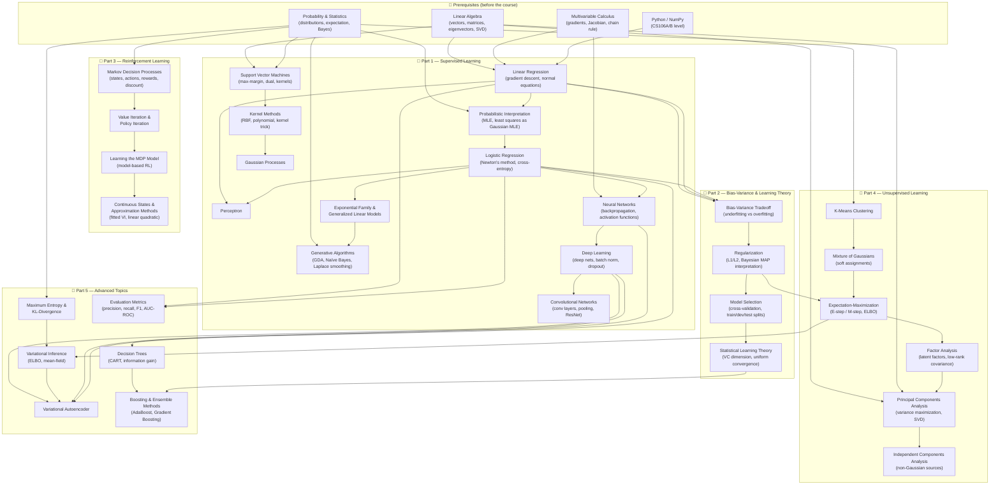

# CS229: Machine Learning — Dependency Graph

Stanford's CS229 is structured in five progressive blocks. Each block depends on the ones before it.
The graph below shows every topic and its prerequisite relationships for a fluent learning curve.

---

## Dependency Graph

---

## Learning Curve: Recommended Order

| Step | Block | Topics |
|------|-------|--------|
| 0 | **Prerequisites** | Linear Algebra → Multivariable Calculus → Probability → Python/NumPy |
| 1 | **Supervised — Linear** | Linear Regression → Probabilistic Interpretation (MLE) → Logistic Regression → Perceptron → GLMs |
| 2 | **Supervised — Generative** | Generative Algorithms (GDA, Naïve Bayes, Laplace smoothing) |
| 3 | **Supervised — Kernel** | SVM → Kernel Methods → Gaussian Processes |
| 4 | **Supervised — Neural** | Neural Networks → Deep Learning → CNNs |
| 5 | **Learning Theory** | Bias-Variance → Regularization → Model Selection → Statistical Learning Theory |
| 6 | **Reinforcement Learning** | MDPs → Value/Policy Iteration → Model-Based RL → Continuous States |
| 7 | **Unsupervised** | K-Means → Mixture of Gaussians → EM → Factor Analysis → PCA → ICA |
| 8 | **Advanced** | Max Entropy / KL-Divergence → Variational Inference → VAE → Decision Trees → Boosting → Eval Metrics |

---

## Key Dependency Rules

- **Linear Algebra** is a hard prerequisite for Linear Regression, SVM, and PCA.
- **Probability** is a hard prerequisite for generative models, EM, and MDPs.
- **MLE / probabilistic interpretation** must come before Logistic Regression and GLMs.
- **EM** is the bridge between unsupervised learning and variational inference.
- **Neural Networks** must precede Deep Learning, CNNs, and VAEs.
- **Bias-Variance** must precede Regularization and Learning Theory.
- **MDPs + Value Iteration** must precede all model-based RL.

---

*Source: [CS229 Stanford](https://cs229.stanford.edu) — curriculum synthesized from the Spring 2026 homepage and the Summer 2019 public syllabus.*